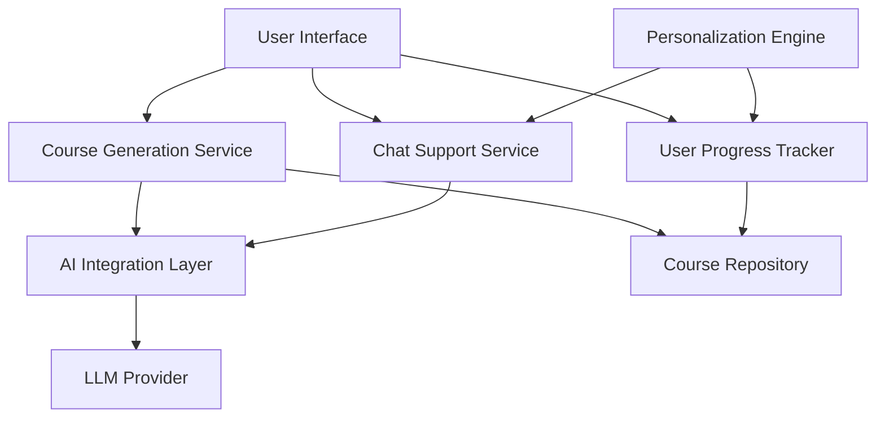

# Design Document: AI Course Generation System

## Overview

The AI Course Generation System is the core feature of Amu, designed to create beginner-friendly programming courses with real-time support. The system focuses on delivering structured, jargon-free content for absolute beginners in programming languages like Python and JavaScript, with an emphasis on a welcoming learning environment, hands-on exercises, and personalized guidance.

This design document outlines the architecture, components, data models, and implementation strategies for building this feature, ensuring it meets all the requirements specified in the requirements document.

## Architecture

The AI Course Generation System will follow a modular architecture with the following high-level components:



### Core System Components

1. **User Interface Layer**

   - Course Creation Interface
   - Course Viewing Interface
   - Chat Interface
   - Progress Dashboard

2. **Service Layer**

   - Course Generation Service
   - Chat Support Service
   - User Progress Service
   - Personalization Service

3. **Data Layer**

   - Course Repository
   - User Progress Repository
   - Interaction History Repository

4. **AI Integration Layer**
   - LLM Provider Integration
   - Prompt Engineering Module
   - Response Processing Module

## Components and Interfaces

### 1. User Interface Components

#### 1.1 Course Creation Interface

The course creation interface will be designed with simplicity in mind, focusing on a welcoming experience for beginners.

**Key Features:**

- Programming language selection (Python, JavaScript)
- Simple, encouraging messaging about learning to code
- Visual representation of course structure
- Progress indicators

**Interface Design:**

```
+-----------------------------------------------+
|                                               |
|  Welcome to Amu! Let's start your coding      |
|  journey together.                            |
|                                               |
|  What would you like to learn?                |
|                                               |
|  [Python]  [JavaScript]                       |
|                                               |
|  We'll create a beginner-friendly course      |
|  just for you!                                |
|                                               |
|  [Create My Course]                           |
|                                               |
+-----------------------------------------------+
```

#### 1.2 Course Viewing Interface

The course viewing interface will present content in a clear, structured manner with emphasis on readability and engagement.

**Key Features:**

- Lesson navigation with progress tracking
- Code examples with syntax highlighting
- Interactive exercises
- Access to chat support
- Encouraging messaging and progress celebration

**Interface Design:**

````
+-----------------------------------------------+
| Course: Python for Beginners                  |
+-----------------------------------------------+
| [Lesson 1] [Lesson 2] [Lesson 3] [Lesson 4]   |
+-----------------------------------------------+
|                                               |
| # Lesson 2: Variables in Python               |
|                                               |
| Variables are like containers that store      |
| information in your program.                  |
|                                               |
| ```python                                     |
| name = "Alex"                                 |
| age = 25                                      |
| print("Hello, " + name)                       |
| ```                                           |
|                                               |
| Try it yourself:                              |
| [Interactive Code Editor]                     |
|                                               |
| [Previous]    [Next]    [Ask for Help]        |
+-----------------------------------------------+
````

#### 1.3 Chat Support Interface

The chat interface will be accessible throughout the learning experience, providing contextual help.

**Key Features:**

- Always-available chat button
- Context-aware assistance
- Beginner-friendly explanations
- Step-by-step guidance for exercises

**Interface Design:**

````
+-----------------------------------------------+
| Chat Support                                  |
+-----------------------------------------------+
|                                               |
| You: I don't understand what a variable is.   |
|                                               |
| Amu: Think of a variable like a labeled box.  |
| The box can hold something inside it - a      |
| number, some text, or other information.      |
|                                               |
| The label on the box (the variable name)      |
| helps you find what's inside later.           |
|                                               |
| For example:                                  |
| ```python                                     |
| score = 10  # 'score' is the label, 10 is     |
| # what's inside the box                       |
| ```                                           |
|                                               |
| Does that help explain it?                    |
|                                               |
| [Type your question here...]                  |
+-----------------------------------------------+
````

### 2. Service Layer Components

#### 2.1 Course Generation Service

This service will handle the creation of course content based on the selected programming language.

**Responsibilities:**

- Process course creation requests
- Generate course structure and content via LLM
- Format and store generated courses
- Ensure beginner-friendly language and progression

**Interface:**

```typescript
interface CourseGenerationService {
  generateCourse(language: string): Promise<Course>;
  generateLesson(courseId: string, lessonNumber: number): Promise<Lesson>;
  generateExercises(lessonId: string): Promise<Exercise[]>;
}
```

#### 2.2 Chat Support Service

This service will manage real-time assistance for students through AI-powered chat.

**Responsibilities:**

- Process user questions
- Generate context-aware, beginner-friendly responses
- Track common questions for course improvement
- Provide step-by-step guidance for exercises

**Interface:**

```typescript
interface ChatSupportService {
  processQuestion(
    question: string,
    context: LearningContext
  ): Promise<ChatResponse>;
  provideExerciseHint(exerciseId: string, progress: string): Promise<string>;
  suggestNextSteps(userId: string, courseId: string): Promise<Suggestion[]>;
}
```

#### 2.3 User Progress Service

This service will track and manage user progress through courses.

**Responsibilities:**

- Record lesson completion
- Track exercise attempts and completions
- Calculate overall course progress
- Store interaction history for personalization

**Interface:**

```typescript
interface UserProgressService {
  recordLessonCompletion(userId: string, lessonId: string): Promise<void>;
  recordExerciseAttempt(
    userId: string,
    exerciseId: string,
    success: boolean
  ): Promise<void>;
  getProgress(userId: string, courseId: string): Promise<Progress>;
  getStrengthsAndWeaknesses(userId: string): Promise<SkillAssessment>;
}
```

#### 2.4 Personalization Service

This service will provide customized recommendations and adaptations based on user behavior.

**Responsibilities:**

- Analyze user progress and interaction patterns
- Generate personalized recommendations
- Adapt content difficulty based on performance
- Create encouraging interventions for inactive users

**Interface:**

```typescript
interface PersonalizationService {
  generateRecommendations(userId: string): Promise<Recommendation[]>;
  identifyStruggleAreas(userId: string): Promise<ConceptArea[]>;
  createReengagementMessage(userId: string): Promise<string>;
  adaptExerciseDifficulty(
    userId: string,
    conceptId: string
  ): Promise<DifficultyLevel>;
}
```

### 3. AI Integration Layer

#### 3.1 LLM Provider Integration

This component will handle communication with the LLM provider (e.g., OpenAI, Anthropic).

**Responsibilities:**

- Manage API connections to LLM providers
- Handle request formatting and response parsing
- Implement retry and fallback mechanisms
- Monitor usage and performance

**Interface:**

```typescript
interface LLMProviderIntegration {
  generateContent(
    prompt: string,
    parameters: GenerationParameters
  ): Promise<string>;
  generateChatResponse(
    conversation: Message[],
    parameters: ChatParameters
  ): Promise<string>;
  generateStructuredOutput<T>(prompt: string, outputSchema: Schema): Promise<T>;
}
```

#### 3.2 Prompt Engineering Module

This component will create and manage prompts for different course generation and chat support needs.

**Responsibilities:**

- Maintain prompt templates for course generation
- Create context-aware prompts for chat support
- Ensure prompts produce beginner-friendly content
- Optimize prompts based on response quality

**Interface:**

```typescript
interface PromptEngineeringModule {
  createCourseGenerationPrompt(language: string): string;
  createLessonGenerationPrompt(courseId: string, lessonNumber: number): string;
  createExerciseGenerationPrompt(lessonId: string): string;
  createChatResponsePrompt(question: string, context: LearningContext): string;
}
```

## Data Models

### Course Model

```typescript
interface Course {
  id: string;
  title: string;
  language: string;
  description: string;
  estimatedDuration: number; // in minutes
  createdAt: Date;
  updatedAt: Date;
  lessons: Lesson[];
}
```

### Lesson Model

```typescript
interface Lesson {
  id: string;
  courseId: string;
  title: string;
  orderIndex: number;
  content: string; // Markdown content
  learningObjectives: string[];
  estimatedDuration: number; // in minutes
  exercises: Exercise[];
}
```

### Exercise Model

```typescript
interface Exercise {
  id: string;
  lessonId: string;
  title: string;
  description: string;
  difficulty: "beginner" | "practice" | "challenge";
  instructions: string;
  starterCode?: string;
  solutionCode: string;
  hints: string[];
  validationTests?: string[]; // For automated validation
}
```

### User Progress Model

```typescript
interface UserProgress {
  userId: string;
  courseId: string;
  startedAt: Date;
  lastAccessedAt: Date;
  completedLessons: {
    lessonId: string;
    completedAt: Date;
  }[];
  completedExercises: {
    exerciseId: string;
    completedAt: Date;
    attemptCount: number;
  }[];
  overallProgress: number; // 0-100%
}
```

### Chat Interaction Model

```typescript
interface ChatInteraction {
  id: string;
  userId: string;
  courseId?: string;
  lessonId?: string;
  exerciseId?: string;
  question: string;
  response: string;
  timestamp: Date;
  helpful: boolean; // User feedback
  followUpQuestions?: string[];
}
```

## Error Handling

### Error Types

1. **Content Generation Errors**

   - LLM API failures
   - Inappropriate content detection
   - Timeout errors

2. **User Input Errors**

   - Invalid language selection
   - Malformed exercise submissions

3. **Storage Errors**
   - Failed to save course
   - Failed to update progress

### Error Handling Strategy

1. **Graceful Degradation**

   - Provide simplified content when rich content generation fails
   - Fall back to pre-generated content when LLM is unavailable

2. **User-Friendly Error Messages**

   - Convert technical errors to beginner-friendly explanations
   - Provide actionable next steps for users

3. **Automatic Retry**

   - Implement exponential backoff for transient errors
   - Silently retry failed operations when possible

4. **Error Logging and Monitoring**
   - Log detailed error information for debugging
   - Monitor error patterns to improve system reliability

## Testing Strategy

### Unit Testing

- Test individual components in isolation
- Mock dependencies for service layer tests
- Ensure high coverage of business logic

### Integration Testing

- Test interactions between components
- Verify correct data flow between services
- Test database operations

### End-to-End Testing

- Simulate complete user journeys
- Test course generation and consumption flow
- Verify chat support functionality

### LLM Output Testing

- Test prompt effectiveness with different inputs
- Verify content quality and appropriateness
- Ensure beginner-friendliness of generated content

### User Experience Testing

- Conduct usability testing with beginner programmers
- Gather feedback on interface clarity and helpfulness
- Measure learning effectiveness

## Security Considerations

1. **Content Safety**

   - Implement content filtering for both user inputs and AI outputs
   - Prevent generation of harmful or inappropriate content
   - Monitor and log content safety issues

2. **User Data Protection**

   - Secure storage of user progress and interaction data
   - Implement proper authentication and authorization
   - Comply with relevant data protection regulations

3. **API Security**
   - Secure API keys for LLM provider access
   - Implement rate limiting to prevent abuse
   - Monitor for unusual usage patterns

## Performance Considerations

1. **Response Time Optimization**

   - Cache commonly requested course content
   - Optimize LLM prompts for faster generation
   - Implement progressive loading of course content

2. **Resource Utilization**

   - Monitor LLM API usage and costs
   - Implement efficient storage of course content
   - Optimize database queries for progress tracking

3. **Scalability**
   - Design services to scale horizontally
   - Implement queue-based processing for course generation
   - Use serverless functions where appropriate

## Implementation Approach

The implementation will follow an incremental approach:

1. **Phase 1: Core Course Generation**

   - Implement basic course structure generation
   - Create simple lesson content generation
   - Develop basic exercise generation

2. **Phase 2: User Interface and Progress Tracking**

   - Implement course viewing interface
   - Develop progress tracking functionality
   - Create basic personalization features

3. **Phase 3: Chat Support Integration**

   - Implement chat interface
   - Develop context-aware response generation
   - Create exercise hint system

4. **Phase 4: Refinement and Enhancement**
   - Improve content quality based on feedback
   - Enhance personalization features
   - Optimize performance and reliability

## Conclusion

This design provides a comprehensive blueprint for implementing the AI Course Generation System for Amu. The system will create beginner-friendly programming courses with real-time support, focusing on a welcoming learning environment and personalized guidance. By following this design, the implementation will meet all the requirements specified in the requirements document while ensuring a high-quality, engaging learning experience for beginner programmers.
